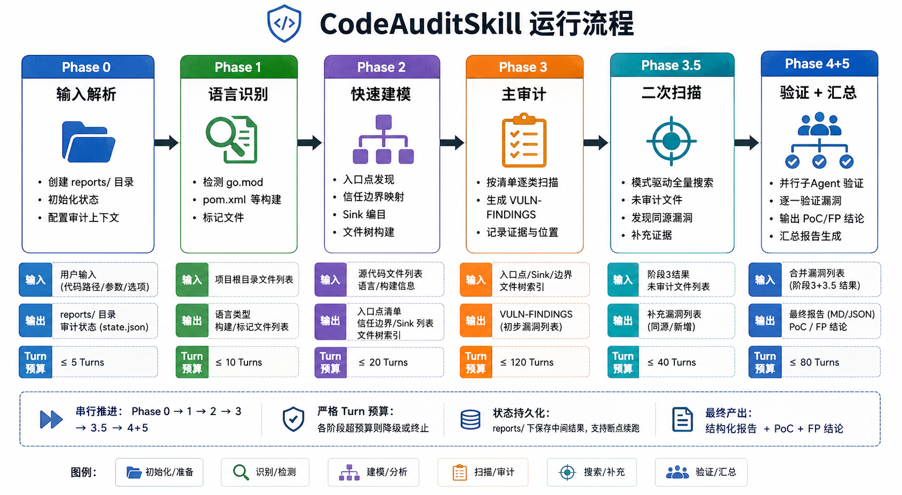

# CodeAuditSkill — Web 漏洞代码审计 Skill

[](LICENSE)
[](https://claude.ai/code)

**CodeAuditSkill** 是一个运行在 Claude Code 中的 Web 项目安全代码审计 Skill。给定一个 Web 项目目录，自动识别语言与框架，按语言专属漏洞清单进行系统化源码审计，对每条高中危漏洞并行启动子 Agent 进行可利用性验证，最终输出可交付的审计报告。

> 覆盖 **Go / Java / Python / PHP / JavaScript(Node.js)** 五种语言。 审计 **SQL 注入、SSRF、XSS、命令注入、路径穿越、反序列化、认证绕过、XXE、敏感信息泄露、逻辑漏洞** 等十余类 Web 漏洞。

---

## 🏆 CNVD 漏洞发现

<div align="center">

### **CodeAuditSkill 已成功发现并获得 43 个 CNVD 编号 🦞**
### **涉及 23 个知名开源项目**

</div>

| CNVD 编号 | 项目 | 项目热度 | 漏洞类型 |
|:---|:---|:---:|:---|
| CNVD-2026-14238 | 思源笔记 | [](https://github.com/siyuan-note/siyuan) | 文件上传 |
| CNVD-2026-20847 | RuoYi-Vue-Pro | [](https://github.com/YunaiV/ruoyi-vue-pro) | SQL 注入 |
| CNVD-2026-21809 | ai-goofish-monitor | [](https://github.com/Usagi-org/ai-goofish-monitor) | 未授权访问 |
| CNVD-2026-21941 | SQLBot | [](https://github.com/dataease/SQLBot) | 未授权访问 |
| CNVD-2026-14195 | WebDAV | [](https://github.com/hacdias/webdav) | 拒绝服务 |
| CNVD-2026-14196 | WebDAV | [](https://github.com/hacdias/webdav) | 逻辑缺陷 |
| CNVD-2025-15886 | QloApps | [](https://github.com/Qloapps/QloApps) | SQL 注入 |
| CNVD-2026-21933 | OneNav | [](https://github.com/helloxz/onenav) | SQL 注入 |
| CNVD-2026-21932 | OneNav | [](https://github.com/helloxz/onenav) | SQL 注入 |
| CNVD-2026-23524 | Cordys CRM | [](https://github.com/1Panel-dev/CordysCRM) | 逻辑缺陷 |
| CNVD-2026-12934 | Cordys CRM | [](https://github.com/1Panel-dev/CordysCRM) | SQL 注入 |
| CNVD-2026-13890 | Sonic | [](https://github.com/go-sonic/sonic) | 逻辑缺陷 |
| CNVD-2026-13697 | Go Ldap Admin | [](https://github.com/eryajf/go-ldap-admin) | 逻辑缺陷 |
| CNVD-2026-13724 | Go Ldap Admin | [](https://github.com/eryajf/go-ldap-admin) | 信息泄露 |
| CNVD-2026-13723 | Go Ldap Admin | [](https://github.com/eryajf/go-ldap-admin) | 信息泄露 |
| CNVD-2026-21936 | OpeniLink Hub | [](https://github.com/openilink/openilink-hub) | 逻辑缺陷 |
| CNVD-2026-20061 | ovpn-admin | [](https://github.com/flant/ovpn-admin) | 命令执行 |
| CNVD-2026-12995 | ovpn-admin | [](https://github.com/flant/ovpn-admin) | 命令执行 |
| CNVD-2026-13674 | ovpn-admin | [](https://github.com/flant/ovpn-admin) | 信息泄露 |
| CNVD-2026-15083 | ovpn-admin | [](https://github.com/flant/ovpn-admin) | 信息泄露 |
| CNVD-2025-14906 | Tduck 填鸭表单 | [](https://github.com/TDuckCloud/tduck-platform) | SQL 注入 |
| CNVD-2026-21910 | AnQiCMS | [](https://github.com/fesiong/anqicms) | 逻辑缺陷 |
| CNVD-2026-21909 | AnQiCMS | [](https://github.com/fesiong/anqicms) | 任意文件读取 |
| CNVD-2026-21908 | AnQiCMS | [](https://github.com/fesiong/anqicms) | SQL 注入 |
| CNVD-2026-21927 | fuint 会员营销系统 | [](https://github.com/fushengqian/fuint) | 逻辑缺陷 |
| CNVD-2026-21926 | fuint 会员营销系统 | [](https://github.com/fushengqian/fuint) | 逻辑缺陷 |
| CNVD-2026-21925 | fuint 会员营销系统 | [](https://github.com/fushengqian/fuint) | 未授权访问 |
| CNVD-2026-21924 | fuint 会员营销系统 | [](https://github.com/fushengqian/fuint) | 未授权访问 |
| CNVD-2026-25468 | OpenOcta | [](https://github.com/openocta/openocta) | 命令执行 |
| CNVD-2026-24513 | KiwiFS | [](https://github.com/kiwifs/kiwifs) | SQL 注入 |
| CNVD-2026-21930 | Komari | [](https://github.com/komari-monitor/komari) | 拒绝服务 |
| CNVD-2026-23545 | Borg UI | [](https://github.com/karanhudia/borg-ui) | 命令执行 |
| CNVD-2026-23544 | Borg UI | [](https://github.com/karanhudia/borg-ui) | 命令执行 |
| CNVD-2026-23132 | Borg UI | [](https://github.com/karanhudia/borg-ui) | 命令执行 |
| CNVD-2026-23131 | Borg UI | [](https://github.com/karanhudia/borg-ui) | 命令执行 |
| CNVD-2026-23109 | Borg UI | [](https://github.com/karanhudia/borg-ui) | 命令执行 |
| CNVD-2026-23018 | Borg UI | [](https://github.com/karanhudia/borg-ui) | 目录遍历 |
| CNVD-2026-23017 | Borg UI | [](https://github.com/karanhudia/borg-ui) | 命令执行 |
| CNVD-2026-21912 | Borg UI | [](https://github.com/karanhudia/borg-ui) | 命令执行 |
| CNVD-2026-21911 | Borg UI | [](https://github.com/karanhudia/borg-ui) | 命令执行 |
| CNVD-2026-14017 | GFast | [](https://github.com/tiger1103/gfast) | SQL 注入 |
| CNVD-2026-13727 | GFast | [](https://github.com/tiger1103/gfast) | 信息泄露 |
| CNVD-2026-24649 | PandaX 物联网平台 | [](https://gitee.com/XM-GO/PandaX) | 信息泄露 |
| CNVD-2026-24647 | PandaX 物联网平台 | [](https://gitee.com/XM-GO/PandaX) | 逻辑缺陷 |
| CNVD-2026-24648 | PandaX 物联网平台 | [](https://gitee.com/XM-GO/PandaX) | 任意文件读取 |
| CNVD-2026-24514 | NexIoT AI 物联网平台 | [](https://gitee.com/NexIoT/nexiot) | SQL 注入 |

> *以上漏洞由 CodeAuditSkill 自动化审计发现，经人工确认后提交 CNVD*

> 如果您使用 CodeAuditSkill 发现了漏洞，欢迎在 [Issues](https://github.com/zhiyuwang720-dev/CodeAuditSkill/issues) 中留言反馈！

---

## 目录

- [🏆 CNVD 漏洞发现](#-cnvd-漏洞发现)
- [设计理念](#设计理念)
- [审计流水线](#审计流水线)
- [核心设计](#核心设计)
  - [文件树与审计覆盖标记](#1-文件树与审计覆盖标记)
  - [Agent Contract 工具约束](#2-agent-contract-工具约束)
  - [Turn 预留规则](#3-turn-预留规则)
  - [Phase 3.5 — 系统性缺陷发现](#4-phase-35--同类漏洞二次寻找与系统性缺陷发现)
  - [并行化漏洞验证](#5-并行化漏洞验证)
  - [动态验证问题清单](#6-动态验证问题清单)
- [支持的语言与漏洞类型](#支持的语言与漏洞类型)
- [报告输出](#报告输出)
- [使用方式](#使用方式)
- [项目结构](#项目结构)
- [设计决策记录](#设计决策记录)

---

## 设计理念


CodeAuditSkill 的设计围绕以下原则：

| 原则 | 说明 |
|------|------|
| **语言专属知识** | 每种语言有独立的漏洞清单，含框架特定的 sink 关键词、易漏场景、判定规则 |
| **先建模再扫描** | 先理解入口点、信任边界和危险 sink 分布，再开始逐类审计，避免"盲扫" |
| **假设有罪，并行验证** | 每条漏洞默认值得报告（存疑时报 Medium 而非丢弃），然后并行启动独立子 Agent 逐一验证 |
| **优先真实运行** | PoC 验证优先拉起 Docker 环境发真实 HTTP 请求，失败才降级为静态推理 |
| **交付级输出** | 报告含代码位置、数据流追踪、curl 复现命令、修复建议、修复后验证方法 |

---

## 审计流水线

整个审计流程分为 **6 个阶段**，串行推进，每阶段有明确的输入、输出和 Turn 预算约束：

    

### Phase 0 — 输入解析
解析目标项目路径，创建 `reports/` 输出目录，记录审计起始时间。

### Phase 1 — 项目类型识别
在项目根目录检测构建标记文件（`go.mod` / `pom.xml` / `requirements.txt` / `composer.json` / `package.json`），自动判定语言。同时扫描框架 import（Gin / Spring Boot / Flask / Laravel / Express 等），为 Phase 2 精准定位入口点做准备。**支持混合语言项目**（如 Go 后端 + React 前端），按文件后缀路由到不同清单。

### Phase 2 — 快速建模（10~20 分钟）
从"盲扫"变为"精准打击"的关键阶段：
1. **入口点发现** — 路由注册、Controller、Handler、Filter
2. **信任边界映射** — HTTP 输入 / DB / Redis / MQ / 第三方 HTTP / 配置源
3. **高危 Sink 编目** — 命令执行、SQL、文件操作、网络请求、模板、反序列化
4. **初始文件树** — 全目录到文件，源码标记 `(未审计)`，后续审计后改为 `(审计)`

### Phase 3 — 主审计
按语言清单的漏洞类别逐类扫描。**仅记录 High / Medium**，Low 跳过不写入报告。每条发现立即追加到主审计报告，同步更新文件树的审计标记。**Turn 预算为 30**（小项目 20，大项目 40），达到 `max_turns - 3` 时强制停止探索并输出。

### Phase 3.5 — 系统性缺陷二次扫描
**本项目的核心创新之一**。当 Phase 3 发现某类漏洞仅有 1-2 个实例时，可能指向系统性缺陷——相同模式在未审计文件中存在更多遗漏。详见[下文](#4-phase-35--同类漏洞二次寻找与系统性缺陷发现)。

### Phase 4 — 并行漏洞验证
对每条 High / Medium 漏洞 **并行 spawn 独立子 Agent**，按验证问题清单逐项作答，尝试运行时复现（Docker/docker-compose → 真实 HTTP 请求），输出 PoC 报告或误判说明。

### Phase 5 — 汇总
收集所有子 Agent 的验证结果，在主审计报告末尾追加验证结果汇总表。

---

## 核心设计

### 1. 文件树与审计覆盖标记

传统审计报告只列出发现的漏洞，读者无法判断"没报告的地方是审计了没发现问题，还是根本没审计到"。本 Skill 在报告 §2.5 中嵌入**完整的项目文件树**，每个源码文件后标记审计状态：

```
project/
├── README.md
├── go.mod
├── internal/
│   ├── controller/
│   │   ├── user_controller.go        (审计)
│   │   ├── ai_controller.go          (审计)
│   │   └── debug_controller.go       (未审计)
│   └── service/
│       └── user_service.go           (未审计)
└── pkg/
    └── htmltext/
        └── htmltext.go               (审计)
```

**设计意图**：
- **可审计性透明** — 一眼看出哪些代码被覆盖、哪些被遗漏
- **驱动 Phase 3.5** — 未审计文件列表直接作为二次扫描的优先目标
- **交付可信度** — 安全团队和客户可以评估审计的完整性

标记规则：仅源码文件（`.go` / `.java` / `.py` / `.php` / `.js` / `.ts` 等）打标记；配置、文档、测试桩不打标记；自动生成文件（`*.pb.go`、`*_gen.go`）排除。

---

### 2. Agent Contract — 工具约束

每个执行审计或验证的 Agent 受严格的工具使用约束，确保搜索效率和输出质量：

| 约束 | 规则 |
|------|------|
| **搜索工具** | 必须使用 Grep（ripgrep 模式，1-3 秒定位）、Glob（文件名匹配）、Read（读文件） |
| **禁止操作** | **Bash 中的 `grep` / `find` / `cat`** — 这些绕过了工具的索引优化，造成性能退化 |
| **超时控制** | Bash 超时 ≤ 30s；Grep 连续失败 2 次 → 缩小搜索路径或跳过 |
| **范围限定** | 搜索路径排除 `vendor/`、`node_modules/`、`.git/`、`build/`、`dist/`、`test/` |

**为什么禁止 Bash grep/find/cat？** Claude Code 的 Grep 工具底层使用 ripgrep 并享受索引加速，而 Bash 中的 `grep` 是原始逐行扫描，在大代码库中会导致数倍的性能差异。这个约束是经过实际审计场景验证的工程决策。

不同阶段的工具调用上限：

| 阶段 | 工具调用上限 | Bash 上限 | max_turns |
|------|-------------|----------|-----------|
| Phase 3 主审计 | 无硬上限（受 Turn 预算约束） | — | 30（小 20/大 40） |
| Phase 3.5 二次扫描 | ≤ 40 次 | ≤ 5 次 | 20 |
| Phase 4 子 Agent | ≤ 30 次 | ≤ 5 次 | 15 |

---

### 3. Turn 预留规则

**这是防止输出丢失的关键机制。** Claude Code 的上下文窗口有限，如果不加控制地持续探索，可能在接近上下文上限时产出被截断，导致整个 Agent 的发现全部丢失。

```
Phase 3:  max_turns = 30  →  turns_used ≥ 27 时：立即停止探索，产出结构化输出
Phase 3.5: max_turns = 20 →  turns_used ≥ 17 时：立即停止搜索，产出结构化输出
Phase 4:  max_turns = 15  →  turns_used ≥ 12 时：立即停止验证，产出判定结果
```

**设计意图**：
- 最后 3 个 Turn **不得**用于新的 Grep/Read 探索
- 仅用于整理已有发现、格式化输出、写入报告文件
- 确保即使上下文即将耗尽，审计的部分结果也能完整保存

这是一个从实际使用中总结出的经验规则——没有 Turn 预留的 Agent 在大型项目中几乎必然丢失输出。

---

### 4. Phase 3.5 — 同类漏洞二次寻找与系统性缺陷发现

**这是 CodeAuditSkill 最具创新性的设计。** 传统 SAST 工具逐个发现漏洞后就结束了，但实际场景中，如果某类漏洞在代码库中出现 1-2 次，往往意味着代码规范或架构层面的系统性问题，会在更多位置重复出现。

#### 触发条件
Phase 3 完成后，对每种漏洞类型的发现数量进行分类：

| Phase 3 实例数 | Phase 3.5 行为 |
|---------------|---------------|
| 0 | 跳过该类型 |
| 1-2 | **触发二次扫描** — 可能存在更多遗漏 |
| 3-4 | 标记「系统性缺陷」— 不再搜索，直接分析根因 |
| ≥5 | 标记「严重系统性缺陷」— 该类型已是全代码库问题 |

#### 搜索策略（三层优先级）

```
P0 (最高优先): 与已知漏洞文件同目录的 (未审计) 文件
    → 同一模块更可能复用相同的脆弱模式

P1: 包含同类 Sink 函数的所有 (未审计) 文件
    → 全局 Grep 确定，按目录分组

P2: 包含同类 Sink 函数的所有文件（含已审计）
    → 查验 Phase 3 是否有遗漏
```

#### 约束与边界

- 每种类型新发现上限 **8 个**（防止单一模式耗尽 Turn）
- 同类型 **≥3 个**新实例 → 停止该类型搜索，标记系统性缺陷候选
- 与 Phase 3 发现去重（同文件+同行号+同类型 = 不追加）
- Phase 3 已发现 **≥5 个**实例的类型禁止二次搜索（已是严重系统性问题，无需更多实例佐证）

#### 输出

系统性缺陷条目写入审计报告 §4 架构风险，包含：
- 涉及的模块/目录范围
- 根因分析（缺少统一防护函数？代码规范缺失？框架使用方式不当？）
- 全局修复策略（非单点修补）

```
[系统性缺陷] 类型: SQL 注入 (字符串拼接)
  实例数: 7 个（关联 V-003, V-007, V-012, V-018, V-021, V-025, V-029）
  影响范围: internal/service/, pkg/repository/, internal/handler/
  根因分析: 项目未建立统一的 SQL Builder 或参数化规范，
           各模块自行拼接 SQL，fmt.Sprintf 模式在 5 个不同 package 中重复出现
  全局修复建议: 制定 SQL 参数化编码规范 + 引入 go-sqlbuilder 统一构造
```

---

### 5. 并行化漏洞验证

Phase 4 的核心约束是：**所有验证子 Agent 必须在同一次响应内并行 spawn，不得串行。**

#### 为什么必须并行？

一条一条串行验证会导致：
- 前面的 Agent 耗尽上下文，后面的根本没有机会运行
- 总耗时 = 单条耗时 × 漏洞数量（而非 max(单条耗时)）
- 上下文窗口被前面 Agent 的详细输出占满

并行 spawn 确保每个子 Agent 获得**独立、新鲜**的上下文，互不干扰。

#### 验证流程

每个子 Agent 收到完整的验证 prompt，包含漏洞详情 + 验证清单 + 输出模板：

```
1. 按 Q-G1~Q-G5（通用 5 问）+ 类型专项追问逐项作答，带 file:line 证据
2. 尝试运行时验证：
   a. 读 README 提取 docker/docker-compose/make/go run/mvn 启动指令
   b. 启动服务，等待就绪
   c. 构造 PoC payload，发实际 HTTP 请求
   d. 启动失败 → 降级为静态推理，标注「未运行验证，仅静态推理」
3. 综合判定 TP（真实漏洞）/ FP（误判）
4. TP → 按 PoC 模板写 poc-V-{NNN}.md
5. FP → 按误判模板写 fp-V-{NNN}.md
6. 返回一行 JSON 汇总
```

#### 运行时验证优先级

真实运行是验证的"金标准"，本 Skill 按以下优先级尝试启动目标项目：

```
Docker > docker-compose > make > mvn > go run > 降级为静态推理
```

如果环境无法搭建（无 Docker、编译失败、依赖缺失），在报告中显式标注「未运行验证，仅静态推理」，并给出**可执行的 PoC 命令**供人工验证。

---

### 6. 动态验证问题清单

Phase 4 子 Agent 使用的验证清单不是简单的"是否存在漏洞"布尔判断，而是一套**结构化的质疑流程**，包含通用 5 问 + 10 组漏洞类型专项追问。

#### 通用 5 问（每条漏洞必答）

| 编号 | 问题 | 审查重点 |
|------|------|---------|
| **Q-G1** | 用户可控输入是否真的能到达 sink？ | 完整数据流证据链，每跳标注 `file:line` |
| **Q-G2** | 用户输入是否被有效清理？ | 区分有效清理（参数化/白名单/类型校验）与无效清理（只校验长度/只 Replace ".."） |
| **Q-G3** | 代码是否在测试/演示/死代码/自动生成上下文中？ | Build tag、路由注册状态、文件路径 |
| **Q-G4** | 触发需要什么前置条件？ | 登录、角色、配置、前序漏洞 |
| **Q-G5** | 理论威胁 vs 可复现可利用？ | 四个等级：可直接利用 / 有条件可利用 / 理论存在 / 不可利用 |

#### 类型专项追问（10 组）

| 漏洞类型 | 追问数 | 特色问题示例 |
|---------|--------|------------|
| 命令注入 | Q-C1~Q-C4 | 是否数组形式执行 vs 字符串拼接？是否使用 `sh -c`？ |
| SQL 注入 | Q-S1~Q-S4 | ORDER BY/LIMIT 是否白名单映射？错误回显是否泄露结构？ |
| SSRF | Q-R1~Q-R5 | 是否解析 hostname 后再校验 IP（防 DNS Rebinding）？是否回显响应体？ |
| 路径穿越 | Q-P1~Q-P4 | 是否仅做了 `Replace("..", "")`（无效）？是否考虑符号链接逃逸？ |
| XSS/模板注入 | Q-X1~Q-X4 | 渲染上下文是 HTML/JS/URL/CSS？JSON API 字段是否被前端 `innerHTML`？ |
| CSRF/CORS | Q-F1~Q-F3 | 是否同时出现 `Allow-Origin: *` + `Allow-Credentials: true`？ |
| 反序列化(Java) | Q-D1~Q-D4 | Jackson 是否开启 `enableDefaultTyping`？classpath 是否有 gadget 链？ |
| XXE(Java) | Q-E1~Q-E3 | XML 解析器是否禁用 DTD 和外部实体？ |
| 表达式注入 | Q-T1~Q-T3 | 表达式上下文是否能访问 `Runtime`？是否在注解中拼接用户输入？ |
| 文件上传 | Q-U1~Q-U4 | 仅靠后缀名校验？上传目录是否 Web 可访问？解压是否防 zip slip？ |

#### 判定逻辑

```
TP = Q-G1(是) ∧ Q-G2(无有效清理) ∧ Q-G3(否) ∧ Q-G5(至少"有条件可利用")
FP = Q-G1(否) ∨ Q-G2(已被有效清理) ∨ Q-G3(是) ∨ Q-G5(不可利用)
```

这个设计让子 Agent 不是简单地"凭感觉判断"，而是按规范化的证据链推理，每条结论都有 `file:line` 佐证。

---

## 支持的语言与漏洞类型

| 语言 | 识别信号 | 框架覆盖 | 漏洞类型数 |
|------|---------|---------|-----------|
| **Go** | `go.mod` | Gin, Echo, Fiber, Chi, Beego, Gorilla Mux, net/http | 9 大类 |
| **Java** | `pom.xml` / `build.gradle` | Spring Boot/MVC/WebFlux, Servlet, JAX-RS, Struts2 | 13 大类 |
| **Python** | `requirements.txt` / `setup.py` / `pyproject.toml` | Django, Flask, FastAPI | 10 大类 (D1-D10) |
| **PHP** | `composer.json` | Laravel, Symfony, WordPress | 10 大类 (D1-D10) |
| **JavaScript** | `package.json` | Express, Next.js, NestJS, Koa | 10 大类 (D1-D10) |

每种语言的漏洞清单包含：
- **适用范围定义** — 覆盖的框架和技术栈
- **入口点与信任边界** — Phase 2 建模指导
- **高危 Sink 关键词** — 供 Grep 定位的精确模式
- **逐类漏洞检查清单** — 风险信号 + 易漏场景 + 判定规则 + 修复方向
- **供应链速查表** — 已知危险版本的依赖及对应 CVE 类型
- **静态工具推荐** — 辅助验证的 SAST 工具组合

---

## 报告输出

审计完成后在 `{target_project}/reports/` 下生成：

```
reports/
├── {project}-audit-{YYYY-MM-DD}.md   # 主审计报告 (SS1-SS5 结构)
├── poc-V-001.md                       # 真实漏洞 PoC 报告
├── poc-V-003.md
├── fp-V-002.md                        # 误判说明报告
└── ...
```

### 主审计报告结构

| 章节 | 内容 |
|------|------|
| **§1 概览** | 项目信息、技术栈、审计范围、High/Medium 统计；声明不收录 Low |
| **§2 发现列表** | ID / 严重度 / 标题 / 影响 / 位置 表格 |
| **§2.5 文件树** | 全目录到文件，源码标记 `(审计)` / `(未审计)` |
| **§3 详细发现** | 每条 V-XXX 含位置证据、数据流、复现 curl、修复建议、修复后验证 |
| **§4 架构风险** | 系统性缺陷（Phase 3.5 ≥3 实例）+ 全局改进建议 |
| **§5 验证结果** | TP/FP 判定、是否运行验证、详细报告文件链接 |

### PoC 报告（真实漏洞）

每个确认漏洞包含：项目描述、启动方式、漏洞描述与等级、前置条件、影响评估、**代码审计证据**（入口 → 数据流 → Sink 完整链路）、**漏洞利用证明**（逐步 curl 命令 + 实际响应）、修复建议。

### FP 报告（误判）

每个误判包含：原漏洞信息、误判原因精炼总结、**Q 清单逐项答复**（通用 5 问 + 类型专项，带 `file:line` 证据）、建议（是否从报告移除、是否更新审计规则）。

---

## 使用方式

### 前置条件

- 安装 [Claude Code](https://claude.ai/code)
- 将本仓库的 `skills/web-vuln-audit/` 目录配置为 Claude Code Skill

### 基本用法

```
# 对当前目录进行审计
/web-vuln-audit

# 指定目标目录
/web-vuln-audit /path/to/your/web-project
```

Skill 将自动完成 6 阶段审计流程，输出到目标项目的 `reports/` 目录。

### 部分运行

目前 Skill 设计为完整流程运行，不支持单阶段执行。如需单独验证已有发现，可手动构造 Phase 4 子 Agent prompt（参考 `references/validation-questions.md`）。

---

## 项目结构

```
skills/web-vuln-audit/
├── SKILL.md                          # Skill 主定义（完整 6 阶段流水线）
└── references/
    ├── project-detection.md          # Phase 1: 项目语言识别规则 + 框架探测
    ├── go-vuln-checklist.md          # Go 漏洞清单（9 大类 + sink 关键词）
    ├── java-vuln-checklist.md        # Java 漏洞清单（13 大类 + sink 关键词）
    ├── python-vuln-checklist.md      # Python 漏洞清单（D1-D10 语义提示）
    ├── php-vuln-checklist.md         # PHP 漏洞清单（D1-D10 语义提示）
    ├── javascript-vuln-checklist.md  # JavaScript 漏洞清单（D1-D10 语义提示）
    ├── audit-report-template.md      # 主审计报告模板（SS1-SS5 结构）
    ├── validation-questions.md       # Phase 4: 验证问题清单（通用 5 问 + 10 组专项）
    ├── poc-report-template.md        # 真实漏洞 PoC 报告模板
    ├── false-positive-template.md    # 误判验证报告模板
    └── example-reports/
        ├── go-example.md             # Go 项目示范报告（Apache Answer, 18 条发现）
        ├── java-example.md           # Java 项目示范报告（CordysCRM, 15 条发现）
        └── poc-V-009.md              # PoC 示范：JWT_SECRET 随机化漏洞
```

---


---

## 设计决策记录

| 决策 | 理由 |
|------|------|
| **只审计 High/Medium，不收录 Low** | Low 漏洞（缺失安全头、信息泄露等）数量大但价值低，写入报告会稀释关键发现。存疑时报 Medium 进入 Phase 4 验证，而非丢弃 |
| **Phase 4 子 Agent 必须并行** | 串行会导致上下文被前面的 Agent 耗尽，后进的 Agent 无法运行 |
| **PoC 验证优先运行时** | 静态推理无法替代真实 HTTP 请求的确定性：一个"看上去能利用"的 sink 可能被上游的框架层拦截 |
| **Turn 预留 3 个** | 实验中观察到的安全边界：少于 3 个 Turn 时，输出阶段可能被截断 |
| **每种语言独立清单** | 不同语言的 sink 函数、框架模式、常见误判模式完全不同，统一清单会导致误报率失控 |
| **SSRF 仅端口扫描不算漏洞** | 端口扫描本身危害有限，必须能达成文件读取或内网 RCE 链才计入 High/Medium |
| **存储型 XSS 才计入，反射型跳过** | 反射型 XSS 在现代浏览器中受 XSS Auditor/SameSite 等机制限制，实际危害远低于存储型 |
| **Phase 3.5 上限每类 8 个** | 防止单一模式耗尽所有 Turn；更关注识别"系统性模式"而非枚举每一个实例 |

---

## License

MIT

---

